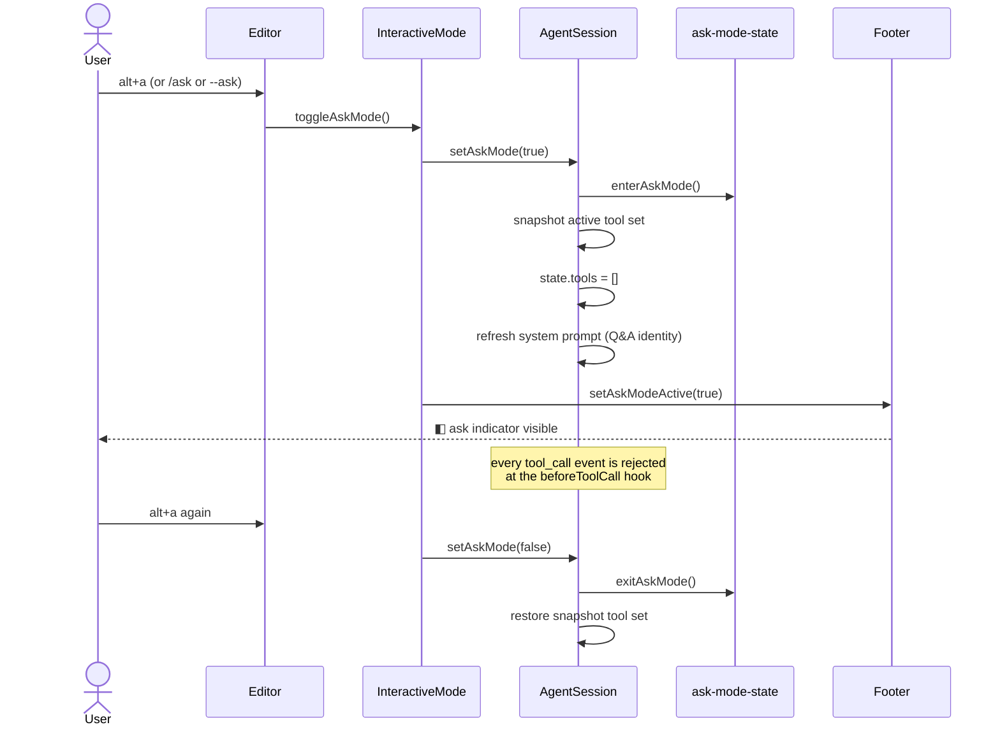

# Task-Completion Report

## 1. Summary

This change adds ask mode and a default-collapsed session tree with lineage tagging to `packages/coding-agent`. Ask mode (CLI flag `--ask`, `/ask` slash command, `alt+a` toggle) disables all file/bash/edit/write tools, swaps the system prompt for a Q&A identity, blocks tool calls at runtime, and is mutually exclusive with plan mode. The session tree now starts collapsed by default, supports Left/Right fold/expand, auto-expands nodes the cursor enters, and renders new `⎇` (fork) and `✦` (plan) relation markers via a new `SessionParentRelation` type threaded through `SessionManager`, `AgentSessionRuntime`, and the extension `newSession` API. Plan mode's "new session" choice (3) now auto-executes the plan in a clean session linked via `parentRelation: "plan"` and auto-names the new session from the plan H1 for `/resume` traceability.

## 2. Mermaid sequence diagram

The largest user-visible flow delta is ask mode toggle and the runtime guarantee that no tool call slips through.



## 3. Diff blocks

### Ask mode API on `AgentSession`

```diff
--- a/packages/coding-agent/src/core/agent-session.ts
+++ b/packages/coding-agent/src/core/agent-session.ts
@@ private _executePlan: { planPath: string; title?: string } | undefined = undefined;
+	private _askModeActiveToolNames: string[] = [];
+
+	// constructor
+	if (isInAskMode()) {
+		this._askModeActiveToolNames = this.getActiveToolNames().slice();
+		this.agent.state.tools = [];
+		this._refreshBaseSystemPrompt();
+	}
+
+	setAskMode(enabled: boolean): void {
+		if (enabled === isInAskMode()) return;
+		if (enabled) {
+			this._askModeActiveToolNames = this.getActiveToolNames().slice();
+			enterAskMode();
+			this.agent.state.tools = [];
+			this._refreshBaseSystemPrompt();
+		} else {
+			exitAskMode();
+			this.setActiveToolsByName(this._askModeActiveToolNames);
+			this._askModeActiveToolNames = [];
+		}
+	}
```

### Runtime tool-call block

```diff
--- a/packages/coding-agent/src/core/agent-session.ts
+++ b/packages/coding-agent/src/core/agent-session.ts
@@ private _installAgentToolHooks(): void {
 	this.agent.beforeToolCall = async ({ toolCall, args }) => {
+		if (isInAskMode()) {
+			throw new Error(`Ask mode: the ${toolCall.name} tool is not available.`);
+		}
+
 		const runner = this._extensionRunner;
```

### System prompt branch on ask mode

```diff
--- a/packages/coding-agent/src/core/system-prompt.ts
+++ b/packages/coding-agent/src/core/system-prompt.ts
+export interface BuildSystemPromptOptions {
+	askMode?: boolean;
+	...
+}
+
+export const ASK_MODE_SYSTEM_PROMPT =
+	"You are a helpful Q&A assistant. Answer the user's questions clearly and concisely using your existing knowledge and reasoning.";
+
+if (askMode) {
+	addGuideline("Be concise in your responses");
+	addGuideline("Answer based on your existing knowledge");
+	addGuideline("Do not guess; say so if you do not know");
+	prompt = `${ASK_MODE_SYSTEM_PROMPT}
+
+Available tools:
+${toolsList}
+
+Guidelines:
+${guidelines}`;
+} else {
+	// existing expert-coding-assistant identity, including Pi docs block
+}
+
-if (planMode) { ... }
+if (planMode && !askMode) { ... }
-if (executePlan) { ... }
+if (executePlan && !askMode) { ... }
```

### Session tree fold/expand (default-collapsed, cursor-driven)

```diff
--- a/.../components/session-selector.ts
+++ b/.../components/session-selector.ts
+	private foldedPaths: Set<string> = new Set();
+	private foldStateInitialized = false;
+	private sessionByPath: Map<string, SessionInfo> = new Map();
+	private autoExpanded: Set<string> = new Set();
+
+	private seedDefaultFoldState(roots: SessionTreeNode[]): void {
+		if (this.foldStateInitialized) return;
+		// Fold every node with children, except ancestors of current session.
+		...
+	}
+
+	private expandSelected(): void {
+		// Reveal selected node's children; re-fold auto-expanded nodes the cursor left.
+		...
+	}
+
+	if (kb.matches(keyData, "tui.select.up"))     { ...; this.expandSelected(); }
+	if (kb.matches(keyData, "tui.select.down"))   { ...; this.expandSelected(); }
+	if (kb.matches(keyData, "tui.select.pageUp")) { ...; this.expandSelected(); }
+	if (kb.matches(keyData, "tui.select.pageDown")) { ...; this.expandSelected(); }
+
+	// Left/Right: collapse/expand tree nodes, only in threaded tree view.
+	else if (treeViewActive && kb.matches(keyData, "tui.editor.cursorLeft")) {
+		// collapse selected if has children and expanded
+	}
+	else if (treeViewActive && kb.matches(keyData, "tui.editor.cursorRight")) {
+		// expand selected if has children and folded
+	}
```

### Lineage relation markers in tree

```diff
+	private buildRelationTag(relation: SessionParentRelation | undefined): string {
+		if (!relation) return "";
+		switch (relation) {
+			case "fork": return theme.fg("accent", "⎇ ");
+			case "plan": return theme.fg("warning", "✦ ");
+			default: return "";
+		}
+	}
```

### `SessionParentRelation` threading

```diff
+export type SessionParentRelation = "fork" | "plan";
+
 export interface SessionHeader {
   ...
   parentSession?: string;
+  parentRelation?: SessionParentRelation;
 }
+
+// SessionManager.newSession, fork, branch — pass parentRelation through.
+// SessionInfo.parentRelation propagated via buildSessionInfo.
+
+// newSession API surfaces (runtime + extension):
+newSession(options?: {
+  parentSession?: string;
+  parentRelation?: SessionParentRelation;
+  ...
+})
```

### Plan mode "new session" auto-execution

The test diff makes the contract explicit:

```diff
- // Clean new session, NOT a fork — no inherited planning conversation.
+ // Clean new session with lineage back to the planning session, NOT a fork.
  expect(fakeThis.runtimeHost.newSession).toHaveBeenCalledTimes(1);
+ expect(fakeThis.runtimeHost.newSession).toHaveBeenCalledWith({
+   parentSession: expect.any(String),
+   parentRelation: "plan",
+ });
  expect(fakeThis.runtimeHost.fork).not.toHaveBeenCalled();
  expect(fakeThis.session.setSessionNote).toHaveBeenCalledTimes(1);
  const note = fakeThis.session.setSessionNote.mock.calls[0]![0] as string;
  expect(note).toContain(expectedDraftPath);
+ // The execution turn is kicked off automatically.
+ expect(fakeThis.session.prompt).toHaveBeenCalledTimes(1);
+ const promptText = fakeThis.session.prompt.mock.calls[0]![0] as string;
+ expect(promptText).toContain(expectedDraftPath);
+ // New session is auto-named from the plan H1 title for /resume traceability.
+ expect(fakeThis.session.sessionManager.appendSessionInfo).toHaveBeenCalledTimes(1);
+ expect(fakeThis.session.sessionManager.appendSessionInfo).toHaveBeenCalledWith("test");
```

### `derivePlanTitle` split out of `derivePlanSlug`

```diff
-export function derivePlanSlug(content: string): string {
-  const lines = content.split("\n");
-  let title: string | undefined;
-  for (const line of lines) {
-    const trimmed = line.trim();
-    if (trimmed.startsWith("# ")) {
-      const heading = trimmed.slice(2).trim();
-      const match = heading.match(/^plan\s*[:\-—]\s*(.+)$/i);
-      title = match ? match[1]!.trim() : heading;
-      break;
-    }
-  }
-  const base = title ? slugify(title) : "";
-  return base || `plan-${Date.now()}`;
-}
+export function derivePlanTitle(content: string): string | undefined {
+  const lines = content.split("\n");
+  for (const line of lines) {
+    const trimmed = line.trim();
+    if (trimmed.startsWith("# ")) {
+      const heading = trimmed.slice(2).trim();
+      const match = heading.match(/^plan\s*[:\-—]\s*(.+)$/i);
+      const title = match ? match[1]!.trim() : heading;
+      return title.length > 0 ? title : undefined;
+    }
+  }
+  return undefined;
+}
+
+export function derivePlanSlug(content: string): string {
+  const title = derivePlanTitle(content);
+  const base = title ? slugify(title) : "";
+  return base || `plan-${Date.now()}`;
+}
```

## 4. Test plan

### Unit

- `test/args.test.ts` — `--ask` parses with `result.ask === true` and the message preserved as the first positional. Expected: the new "parses --ask flag" test passes.
- `test/system-prompt.test.ts` ask-mode block — with `askMode: true`, prompt contains `Q&A assistant`, does NOT contain `expert coding assistant` or `Pi documentation`, lists any tool snippets passed in, includes the three ask-mode guidelines, and omits the `## Plan Mode` / `## Executing Plan` sections even when those flags are also set.
- `test/suite/plan-mode-state.test.ts` `derivePlanTitle` — returns the title for `# Plan: X`, `# Plan - X`, `# Plan — X`, and `# X` (plain H1); returns `undefined` for empty input, no H1, only H2+, or whitespace-only H1; preserves case, punctuation, and unicode. The split-off `derivePlanSlug` keeps its existing behavior (slug of the title or `plan-<unix-millis>` fallback).

### Integration

- `test/session-selector-path-delete.test.ts` — with a Parent node that has a Child, the default render does NOT show `Child` (default-fold hides the subtree); after `handleInput("\x1b[C")` (Right), the rendered output contains `└─ Child`.
- `test/plan-mode-new-session.test.ts` — picking choice 3 calls `newSession({ parentSession, parentRelation: "plan" })` (NOT `fork`), calls `setSessionNote` with the draft path, calls `session.prompt` once with that path in its text, and calls `sessionManager.appendSessionInfo(<derived title>)` once. Auto-name covers plain H1 (`# Refactor the auth flow` → `Refactor the auth flow`), and long titles are capped at 80 chars with a trailing `...`. Missing-draft and cancelled-newSession paths must not call `prompt` or `appendSessionInfo`.

### E2e / manual

- Launch `pi`, press `alt+a` in the editor. Footer flips to `◧ ask`. Ask the model "what tools do you have" — it should respond with no tools (Q&A identity). Press `alt+a` again — footer clears and the original tool set returns.
- Launch `pi --ask "What is X?"` from the CLI. Verify the same as above on session creation; confirm the model cannot accidentally reach file/bash/edit/write.
- Enter plan mode with `/plan <description>`, write a draft, confirm plan, pick choice 3 (new session). Verify: a new session appears in the selector with a `✦` lineage tag back to the planning session, the new session is auto-named from the plan H1 (visible in `/resume`), and execution kicks off without further user input.
- In the session tree (`/resume`), verify: tree starts collapsed, cursor move auto-expands the selected node's subtree, Left collapses, Right expands, `⎇` shows on forked sessions, `✦` shows on plan-derived sessions.
- `pi --ask` followed by `/plan` — verify ask mode exits cleanly before plan mode enters (mutual exclusion). Reverse: `/plan` then `alt+a` — same.

### Out of scope

- Persistence of ask mode across `/resume` — by design, in-memory only.
- Ask mode + extension tool registration interaction beyond the runtime `beforeToolCall` block; extensions may register tools, but all calls are rejected uniformly while ask mode is active.
- User-configurable default-fold preferences — only manual Left/Right folds and cursor-driven auto-expand are implemented.
- Auto-execution of the plan when `newSession` itself is cancelled — the cancelled path is covered, the auto-execute path is not.
