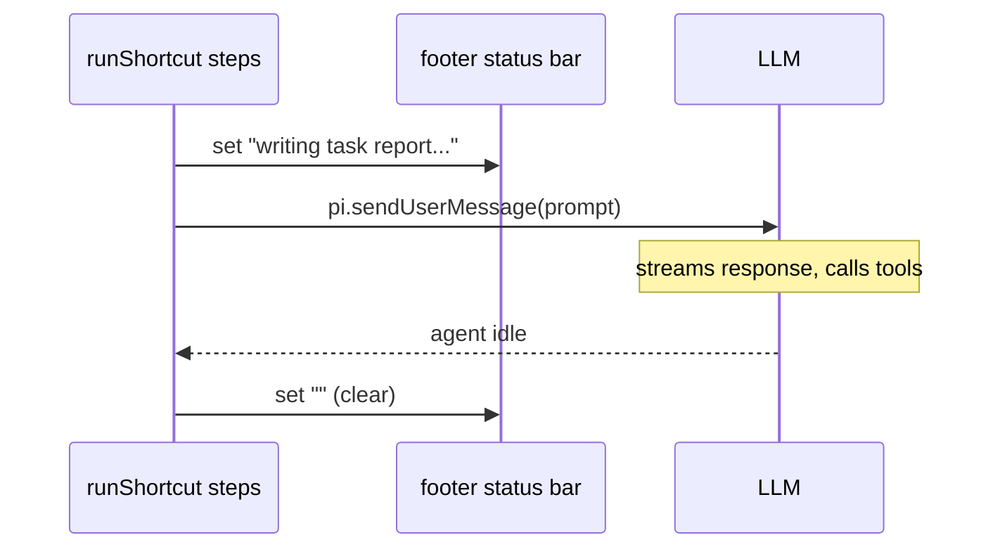
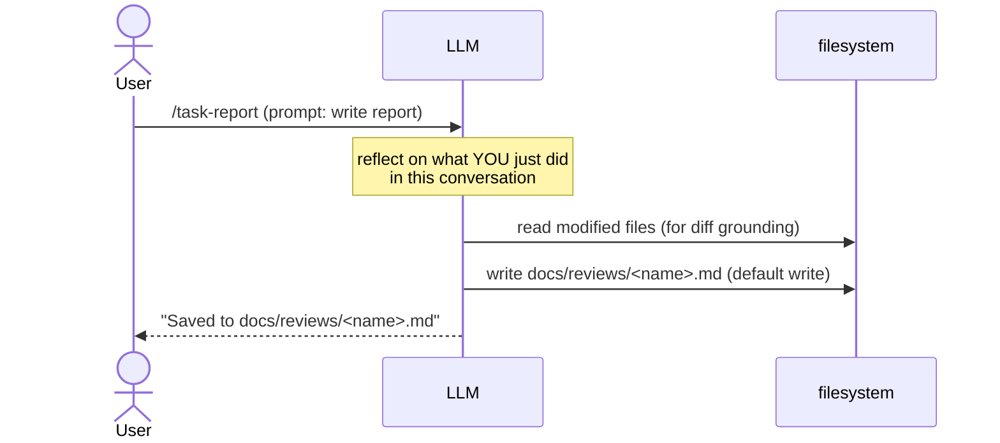
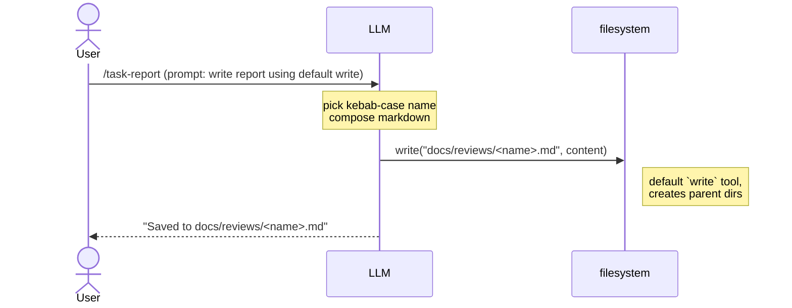
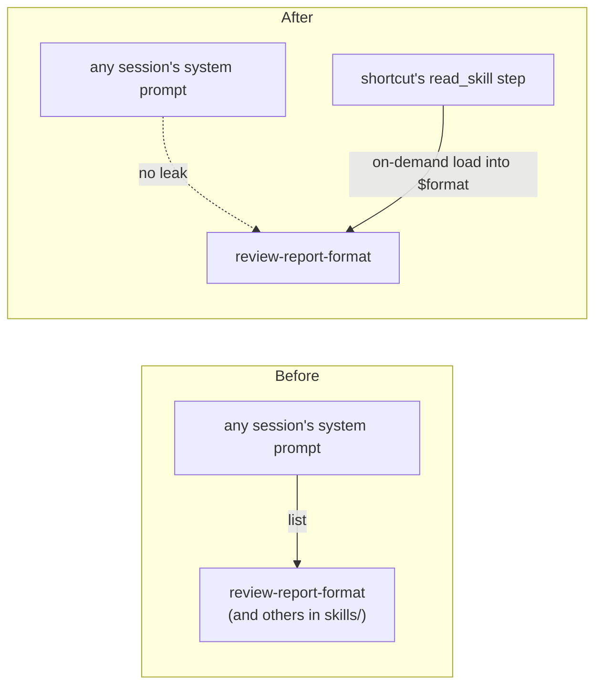

# Task-Completion Report

## 1. Summary

Five cleanup fixes applied to `~/.pi/agent/extensions/shortcuts`, each treated as an independent issue. Together they turn `/task-report` and `/task-report-review` into session-scoped, opinion-free, status-aware commands that use only built-in tools and stay invisible to unrelated sessions. Each issue is verified by its own diff and test plan; cross-cutting deferred work is listed in `Out of scope`.

## 2. Issue 1: Status bar doesn't update after the report finishes

The shortcut called `set_status "writing task report..."` before dispatching the prompt, but nothing cleared the status when the LLM finished. After `/task-report` — and after the second turn of `/task-report-review` — the footer kept showing the stale message indefinitely, because `runShortcut` returned as soon as `pi.sendUserMessage` queued the turn.

The fix pairs each `output` step that triggers a turn with a trailing `wait_idle` + `set_status ""` pair. The wait resolves when the agent goes idle; the empty `set_status` clears the line.

### Mermaid sequence diagram



### Diff blocks

```diff
--- a/shortcuts.json
+++ b/shortcuts.json
@@ shortcut "task-report" steps
 			{ "type": "set_status", "key": "shortcut", "text": "writing task report..." },
 			{ "type": "output", "text": "..." },
+			{ "type": "wait_idle" },
+			{ "type": "set_status", "key": "shortcut", "text": "" }
 		]
 	},
@@ shortcut "task-report-review" steps
 			{ "type": "wait_idle" },
 			{ "type": "set_status", "key": "shortcut", "text": "spawning reviewer..." },
 			{ "type": "output", "text": "..." },
+			{ "type": "wait_idle" },
+			{ "type": "set_status", "key": "shortcut", "text": "" }
 		]
 	},
@@ shortcut "draft-monthly-feedback" steps (same bug, picked up incidentally)
 			{ "type": "set_status", "key": "shortcut", "text": "drafting monthly feedback..." },
 			{ "type": "output", "text": "..." },
+			{ "type": "wait_idle" },
+			{ "type": "set_status", "key": "shortcut", "text": "" }
 		]
 	}
```

### Test plan

- **Unit**: `jq '.["task-report"].steps | map(select(.type == "wait_idle")) | length' ~/.pi/agent/extensions/shortcuts/shortcuts.json` returns 1, and the step immediately after is `set_status` with empty `text`. Same invariant for `task-report-review` (returns 2 wait_idle / 2 trailing clear) and `draft-monthly-feedback` (returns 1 each).
- **Integration**: run `/task-report`. Footer shows `writing task report...` while the LLM streams, then the segment disappears once the LLM returns. Verify with a screen recording or by eye.
- **Integration**: run `/task-report-review`. Footer transitions `writing...` -> `spawning reviewer...` -> empty. Two status changes, then clear.
- **E2e**: trigger `/task-report` then immediately type `/shortcut` (which lists without invoking). The status clears before the next interactive user message is read.

## 3. Issue 2: Source the diff from the session, not from `git diff`

The shortcut ran `bash git-diff.sh` and piped the output into the prompt. Task reports document a single session's work — the agent itself is the most accurate source of truth for what it changed, not the repository's working-tree diff. The previous design also forced the LLM to write hunks it could not ground, because it was handed an opaque blob it had to re-interpret.

The fix removes the `bash` step from both shortcuts. The prompt now tells the LLM to reflect on what it did, and to re-read modified files / run `git diff` itself as a recovery aid if a specific hunk is fuzzy.

### Mermaid sequence diagram



### Diff blocks

```diff
--- a/shortcuts.json
+++ b/shortcuts.json
@@ shortcut "task-report" steps
-		"argumentHint": "<short-name> [focus-area]",
 		"steps": [
-			{ "type": "bash", "script": "git-diff.sh", "var": "diff" },
 			{ "type": "read_skill", "skill": "review-report-format", "var": "format" },
-			{ "type": "ask", "question": "Short name for this report (e.g. auth-refactor).", "var": "name" },
-			{ "type": "ask", "question": "Anything specific to emphasize? (Enter for general)", "var": "focus" },
-			{ "type": "write_file", "path": "docs/reviews/.diff", "content": "$diff" },
 			{ "type": "set_status", "key": "shortcut", "text": "writing task report..." },
 			{
 				"type": "output",
-				"text": "Write a task-completion report per the format spec. Call `save_review_report` once with content=<the markdown following $format exactly> and name='$name'. After the tool returns, briefly tell the user the saved path.\n\n# Format spec\n\n$format\n\n# Focus\n$focus\n\n# Diff\n```\n$diff\n```"
+				"text": "Write a session-level task-completion report for the work YOU just did in this conversation. Reflect on the files you read, wrote, edited, executed, decided. The report's diff blocks must reflect the actual changes you made — re-read the modified files or run `git diff` to ground any hunks you cannot recall exactly.\n\nFollow the format spec exactly. Pick a descriptive kebab-case filename yourself (e.g. `auth-refactor`); do not ask the user. Write the report to `docs/reviews/<your-name>.md` using the default `write` tool. Create the `docs/reviews/` directory first if it does not exist (you can do this with `bash` or by writing a parent path that `write` will create). After writing, briefly tell the user the saved path.\n\n# Format spec\n\n$format"
 			},
@@ shortcut "task-report-review" steps
-		"argumentHint": "<short-name> [focus-area]",
 		"steps": [
-			{ "type": "bash", "script": "git-diff.sh", "var": "diff_file" },
 			{ "type": "read_skill", "skill": "review-report-format", "var": "format" },
-			{ "type": "ask", "question": "Short name for this report (e.g. auth-refactor).", "var": "name" },
-			{ "type": "ask", "question": "Anything specific to emphasize? (Enter for general)", "var": "focus" },
-			{ "type": "write_file", "path": "docs/reviews/.diff", "content": "$diff_file" },
 			{ "type": "set_status", "key": "shortcut", "text": "writing task report..." },
 			{
 				"type": "output",
-				"text": "Write a task-completion report per the format spec. Call `save_review_report` once with content=<the markdown> and name='$name'. After the tool returns, briefly tell the user the saved path.\n\n# Format spec\n\n$format\n\n# Focus\n$focus\n\n# Diff\n```\n$diff_file\n```"
+				"text": "Write a session-level task-completion report for the work YOU just did in this conversation (turn 1 of 2). Reflect on the files you read, wrote, edited, executed, decided. ...\n\nFollow the format spec exactly. Pick a descriptive kebab-case filename yourself (e.g. `auth-refactor`); do not ask the user. Write the report to `docs/reviews/<your-name>.md` using the default `write` tool. Create the `docs/reviews/` directory first if it does not exist.\n\nAfter writing, briefly tell the user the saved path. Do NOT call `subagent` yet — wait for the next turn.\n\n# Format spec\n\n$format"
 			},
@@ turn-2 prompt of "task-report-review"
-				"text": "Now spawn the `task-report-reviewer` subagent to review the report you just saved. The report is at `docs/reviews/$name.md` (use the path you wrote to in the previous turn). The diff is at `docs/reviews/.diff`. Use single mode: { agent: 'task-report-reviewer', task: 'Read docs/reviews/$name.md and docs/reviews/.diff. Focus: $focus. Return your three-section verdict.' }\n\nSummarize the reviewer's verdict back to the user (one paragraph plus the exact verdict line). Do not re-run save_review_report."
+				"text": "Now spawn the `task-report-reviewer` subagent to audit the report you just saved in the previous turn (turn 2 of 2).\n\nUse the saved path from your previous response. Call `subagent` in single mode with this shape:\n\n  agent: \"task-report-reviewer\"\n  task: \"Read the report at <PATH>. Audit it against the actual code: re-read the files mentioned in the diff blocks to verify accuracy, check that the mermaid sequence diagram matches the call/flow order in the code, and confirm the test plan covers the change. Return your three-section verdict (Blockers / Suggestions / Verdict).\"\n\nSubstitute `<PATH>` with the path you actually wrote to in turn 1. After the reviewer returns, summarize the verdict briefly to the user (one paragraph + the exact verdict line)."
```

```diff
--- a/skills/review-report-format/SKILL.md
+++ b/skills/review-report-format/SKILL.md
@@ header
 ---
 name: review-report-format
-description: Output format for a post-development task report. Load when producing or reviewing such a report.
+description: Output format for a session-level task-completion report. Load when producing or reviewing such a report.
 ---
-# Task-Completion Report Format
+# Task-Completion Report Format (session-level)
-A single markdown document. Persist via the `save_review_report` tool, which writes to `docs/reviews/<name>.md`. Pick a descriptive `name` (e.g. `auth-refactor`, `fix-null-safety`); if unsure, omit it and let the timestamp fallback kick in.
+A single markdown document written to `docs/reviews/<name>.md` using the default `write` tool. The author reflects on what they did in the current session — there is no external diff to lean on.
+Pick a descriptive `name` in kebab-case (e.g. `auth-refactor`, `fix-null-safety`).
@@ section "3. Diff blocks" guidance
+**Source of truth**: the changes you actually made in this session. Reconstruct the diff yourself. If your memory is fuzzy on a hunk, re-read the file and compare against your recollection, or run `git diff <path>` against the pre-change state to recover the exact lines. Do not invent hunks you cannot ground.
@@ closing rule
+- Pick the filename yourself; do not ask the user for one.
```

```diff
--- a/agents/task-report-reviewer.md
+++ b/agents/task-report-reviewer.md
-You will be given two file paths in your task string:
-1. A markdown task-completion report at `docs/reviews/<name>.md`.
-2. A diff at `docs/reviews/.diff`.
-Read both. The diff is ground truth.
+You will be given a path to a markdown task-completion report at `docs/reviews/<name>.md`. The report has these sections: Summary, Mermaid sequence diagram, Diff blocks, Test plan. It documents work that was just done in a single pi session — there is no separate diff file.
+Read the report. Then audit it by re-reading the actual code on disk. The code is ground truth.
```

### Test plan

- **Unit**: in `shortcuts.json`, count `bash` steps with `script: "git-diff.sh"` for `task-report` and `task-report-review` — both return 0. Only the unchanged `review-diff` shortcut still uses `git-diff.sh`.
- **Unit**: `grep -rn 'docs/reviews/.diff' ~/.pi/agent/extensions/shortcuts/` returns nothing.
- **Integration**: run `/task-report` in a session that touched files but where `git status` is clean. Report still covers the session's work and references the modified files accurately, demonstrating the agent does not lean on `git diff`.
- **Integration**: run `/task-report-review` after hand-crafting `docs/reviews/foo.md` plus real source-file changes. The reviewer's verdict references the actual code, not a diff file.
- **E2e**: produce a session where the agent only reads files (no writes) and run `/task-report`. The report's "Diff blocks" section is empty or explanatory; the LLM does not hallucinate changes.

## 4. Issue 3: Drop the human-in-the-loop `ask` steps

`/task-report` and `/task-report-review` prompted the user for a short name and a focus area before doing anything. Both are unnecessary for a generic review task — the LLM should pick the filename and approach on its own, and the user should not be interrupted mid-workflow.

### Diff blocks

```diff
--- a/shortcuts.json
+++ b/shortcuts.json
@@ shortcut "task-report" metadata + steps
-		"description": "Produce a post-development task report (mermaid sequence diagram + diff blocks + summary + test plan) and persist it via save_review_report.",
-		"argumentHint": "<short-name> [focus-area]",
+		"description": "Produce a session-level task-completion report (mermaid + diff blocks + summary + test plan) and write it to docs/reviews/ using the default write tool.",
 		"steps": [
-			{ "type": "bash", "script": "git-diff.sh", "var": "diff" },
 			{ "type": "read_skill", "skill": "review-report-format", "var": "format" },
-			{ "type": "ask", "question": "Short name for this report (e.g. auth-refactor)?", "var": "name" },
-			{ "type": "ask", "question": "Anything specific to emphasize? (Enter for general)", "var": "focus" },
-			{ "type": "write_file", "path": "docs/reviews/.diff", "content": "$diff" },
 			{ "type": "set_status", "key": "shortcut", "text": "writing task report..." },
 			{ "type": "output", "text": "..." },
 			{ "type": "wait_idle" },
 			{ "type": "set_status", "key": "shortcut", "text": "" }
 		]
 	},
@@ shortcut "task-report-review" metadata + steps
-		"description": "Same as task-report, plus spawn a fresh pi subprocess to review the saved report against the diff. The reviewer verdict comes back as a notify.",
-		"argumentHint": "<short-name> [focus-area]",
+		"description": "Write a session-level task-completion report, then spawn the task-report-reviewer subagent (via the subagent extension) to audit it against the actual code on disk.",
 		"steps": [
-			{ "type": "bash", "script": "git-diff.sh", "var": "diff_file" },
 			{ "type": "read_skill", "skill": "review-report-format", "var": "format" },
-			{ "type": "ask", "question": "Short name for this report (e.g. auth-refactor)?", "var": "name" },
-			{ "type": "ask", "question": "Anything specific to emphasize? (Enter for general)", "var": "focus" },
-			{ "type": "write_file", "path": "docs/reviews/.diff", "content": "$diff_file" },
 			{ "type": "set_status", "key": "shortcut", "text": "writing task report..." },
 			{ "type": "output", "text": "..." },
 			{ "type": "wait_idle" },
 			{ "type": "set_status", "key": "shortcut", "text": "spawning reviewer..." },
 			{ "type": "output", "text": "..." },
 			{ "type": "wait_idle" },
 			{ "type": "set_status", "key": "shortcut", "text": "" }
 		]
 	}
```

### Test plan

- **Unit**: `jq '.["task-report"].steps | map(select(.type == "ask")) | length' shortcuts.json` returns 0; same for `task-report-review`.
- **Unit**: `jq '.["task-report"].argumentHint // "absent"' shortcuts.json` returns `absent`; same for `task-report-review`.
- **Integration**: run `/task-report`. No interactive modal appears between command invocation and the LLM writing. Status moves directly from idle to `writing task report...`.
- **Integration**: inspect any saved report under `docs/reviews/`. The filename is one the LLM picked itself (kebab-case, descriptive, no trailing timestamp artifact unless the LLM chose one), and the report body has no `Focus:` header that demanded a specific direction.
- **E2e**: in a long session with many touch points, run `/task-report` and observe the LLM picking a sensible filename like `shortcut-task-report-cleanup` rather than asking.

## 5. Issue 4: Replace the `save_review_report` tool with the default `write` tool

The shortcut registered a custom `save_review_report` tool that wrote markdown to `docs/reviews/<name>.md` with name sanitization and timestamp fallback. The default `write` tool already does this — the LLM can write any path it picks and `write` creates parent directories. The custom tool added nothing the model couldn't do itself, and it leaked shortcut-specific surface area into the global tool registry (visible in `pi.getAllTools()` and to the LLM in every session).

The fix removes the tool registration and its supporting helpers (`safeName`, `timestampSlug`, `reportsDir`, plus the `typebox` import). The prompts now tell the LLM to use the default `write` tool.

### Mermaid sequence diagram



### Diff blocks

```diff
--- a/shortcuts/index.ts
+++ b/shortcuts/index.ts
-import type { ExtensionAPI, ExtensionCommandContext } from "@earendil-works/pi-coding-agent";
-import { Type } from "typebox";
+import type { ExtensionAPI, ExtensionCommandContext } from "@earendil-works/pi-coding-agent";
@@
 const scriptsDir = join(baseDir, "scripts");
 const configPath = join(baseDir, "shortcuts.json");
-const reportsDir = "docs/reviews";
-
-function safeName(input: string): string {
-	return (input || "")
-		.toLowerCase()
-		.replace(/[^a-z0-9]+/g, "-")
-		.replace(/^-+|-+$/g, "")
-		.slice(0, 64);
-}
-
-function timestampSlug(d = new Date()): string {
-	const pad = (n: number, w = 2): string => String(n).padStart(w, "0");
-	return (
-		`${d.getUTCFullYear()}${pad(d.getUTCMonth() + 1)}${pad(d.getUTCDate())}` +
-		`-${pad(d.getUTCHours())}${pad(d.getUTCMinutes())}${pad(d.getUTCSeconds())}`
-	);
-}
@@ export default function
-	// Tool the LLM can call to persist a markdown report. Resolution is deterministic so
-	// later `bash` steps (e.g. spawning a reviewer subprocess) can `ls -t` the latest file
-	// without needing to thread variable state through the conversation.
-	pi.registerTool({
-		name: "save_review_report",
-		label: "Save Review Report",
-		description:
-			"Persist a markdown report to docs/reviews/<name>.md under the current working directory. Returns the saved path.",
-		parameters: Type.Object({
-			content: Type.String({ description: "Full markdown content of the report" }),
-			name: Type.Optional(
-				Type.String({
-					description:
-						"Basename without extension. Falls back to a UTC timestamp (YYYYMMDD-HHMMSS).",
-				}),
-			),
-		}),
-		async execute(_toolCallId, params, _signal, _onUpdate, ctx) {
-			const absReportsDir = join(ctx.cwd, reportsDir);
-			mkdirSync(absReportsDir, { recursive: true });
-			const fallback = timestampSlug();
-			const safe = safeName(params.name ?? "");
-			const baseName = safe || fallback;
-			const filePath = join(absReportsDir, `${baseName}.md`);
-			writeFileSync(filePath, params.content, "utf-8");
-			return {
-				content: [{ type: "text", text: `Saved report to ${filePath}` }],
-				details: { path: filePath, name: baseName },
-			};
-		},
-	});
```

```diff
--- a/shortcuts.json — turn-1 prompt of "task-report-review"
 ... "After writing, briefly tell the user the saved path."
-+ " Create the `docs/reviews/` directory first if it does not exist."
-..."Do not re-run save_review_report."
```

(Other `save_review_report` mentions in `shortcuts.json` and `README.md` removed in the same pass; the prompts now say "use the default `write` tool" everywhere.)

```diff
--- a/README.md
+++ b/README.md
-## Provided tools
-
-| name | signature | behavior |
-|---|---|---|
-| `save_review_report` | `{ content: string, name?: string }` | ... |
-
-The `task-report` and `task-report-review` shortcuts lean on this tool. The reviewer in `task-report-review` reads the saved file directly off disk, so file paths do not need to be threaded back through conversation variables.
+## Provided tools
+
+(none — the LLM uses its built-in `write` tool to persist task reports.)
```

### Test plan

- **Unit**: `grep -rn 'save_review_report' ~/.pi/agent/extensions/shortcuts/` returns nothing across all files.
- **Unit**: `grep -n 'from "typebox"' ~/.pi/agent/extensions/shortcuts/index.ts` returns nothing (typebox dependency removed since it was only used by `save_review_report`).
- **Unit**: `grep -n 'safeName\|timestampSlug\|reportsDir' ~/.pi/agent/extensions/shortcuts/index.ts` returns nothing (helpers removed).
- **Integration**: in a running pi session, `pi.getAllTools()` does NOT include `save_review_report`.
- **Integration**: run `/task-report`. The LLM invokes the default `write` tool (visible in tool-call rendering) against `docs/reviews/<name>.md`, NOT a `save_review_report` tool call.
- **E2e**: confirm the parent directory is created automatically: delete `docs/reviews/` manually, run `/task-report`, observe that `write` recreated the directory and the file landed correctly.

## 6. Issue 5: Stop exposing the `review-report-format` skill globally

The extension registered `skillPaths: [skillsDir]` in `resources_discover`, which made every skill under `~/.pi/agent/extensions/shortcuts/skills/` — including `review-report-format` — appear in every session's system prompt. The review-format spec is only useful to the shortcut; loading it during unrelated work pollutes context and risks accidental activation.

The fix removes the `resources_discover` handler entirely. The shortcut's `read_skill` step still loads the format spec content into a prompt variable on demand, but the skill never enters the global discovery layer.

### Mermaid sequence diagram



### Diff blocks

```diff
--- a/shortcuts/index.ts
+++ b/shortcuts/index.ts
 export default function shortcutsExtension(pi: ExtensionAPI): void {
-	// Surface bundled skills to the model (their names appear in the system prompt so
-	// the model can `read` them on-demand). Combined with `read_skill` steps, this gives
-	// the model both choice (system prompt) and forced availability (workflow var).
-	pi.on("resources_discover", () => ({
-		skillPaths: [skillsDir],
-	}));
+	// Skills are loaded on-demand by `read_skill` steps (private to this
+	// extension). They are intentionally NOT registered via `resources_discover`,
+	// so they do not appear in the system prompt for unrelated tasks.

 	// Umbrella command for listing and ad-hoc invocation.
 	pi.registerCommand("shortcut", { ... });
```

### Test plan

- **Unit**: `grep -n 'skillPaths\|resources_discover' ~/.pi/agent/extensions/shortcuts/index.ts` returns nothing.
- **Integration**: in any pi session that is NOT invoking `/task-report`, inspect the system prompt's available-skills section. `review-report-format` does NOT appear, confirming it is no longer in the global discovery pool.
- **Integration**: invoke `/task-report`. The LLM still receives the format spec via the prompt's `$format` substitution, sourced by `read_skill` from disk. The on-demand path is intact.
- **E2e**: kill the extension instance via `/reload` and inspect a freshly started session's system prompt. `review-report-format` still absent, confirming the change is in the discovery layer and not a transient effect.

## 7. Out of scope

- **`code-review-heuristics` and `idp-framework` skills**: now private as a side effect of removing the single `skillPaths` registration in Issue 5. They still work inside `review-diff` and `draft-monthly-feedback` via `read_skill`, but no longer appear in system prompts. Re-expose by moving them to `~/.pi/agent/skills/`. Touching this was out of scope for the current five issues; pick it up as its own issue if you want them public.
- **Pre-existing `docs/reviews/20260715-032044.md`**: not touched; describes a different session's work (the first ad-hoc task report from earlier in this conversation's own history).
- **Other personal extensions in `~/.pi/agent/extensions/`** (`per-model-compaction.ts`, `tps.ts`, `remote-executor`): unchanged.
- **Subagent verdict quality and cost**: dependent on the model and out of scope for these fixes; only the wiring changed.
- **Persisting ask-cancelled state across `/resume`**: by design, not changed.
- **Deterministic filename fallback** previously provided by `save_review_report`'s `timestampSlug`: the LLM now picks the filename itself. If a deterministic fallback is later desired, encode it in the prompt rather than re-introducing a custom tool.
