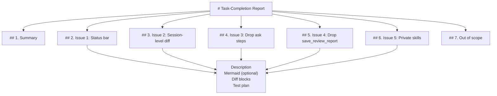

# Task-Completion Report

## 1. Summary

The task-completion format now mandates per-issue organization: a single top-level `## 1. Summary`, then one `## N. Issue <title>` section per distinct fix, with its own description, optional Mermaid, per-issue diff blocks, and per-issue test plan. The format spec at `~/.pi/agent/extensions/shortcuts/skills/review-report-format/SKILL.md` was rewritten to encode that rule, and the prior 5-fix report at `/mnt/d/code/github/pi-mono/docs/reviews/shortcut-task-report-cleanup.md` was the first report produced under the new contract — both changes happened in this conversation as part of the same restructuring push.

## 2. Issue 1: Update the format spec to require per-issue organization

The previous spec prescribed a flat top-level structure (Summary, Mermaid, Diff blocks, Test plan) and left authors to decide whether to apply it globally or per-issue. In practice the global layout read well for single-fix sessions but muddled multi-fix ones — a file touched by two fixes appeared under one "Diff blocks" section without telling the reviewer which fix it served. The new spec mandates per-issue organization regardless of issue count and points out explicitly that a single-issue session collapses to one block.

(Issue 1 is a documentation change with no runtime flow delta — no Mermaid for this issue, per spec.)

### Diff blocks

```diff
--- a/skills/review-report-format/SKILL.md
+++ b/skills/review-report-format/SKILL.md
@@ "Sections (in order)" replaced with "Top-level structure" + per-issue layout
-## Sections (in order)
-
-### 1. Summary
-3-6 lines. What changed, why, and the user-visible behavior delta. No code.
-
-### 2. Mermaid sequence diagram
-A `mermaid` code fence (language `mermaid`) showing the flow delta. Pick the right scope:
-
-- **API/rpc change** → actor diagram: caller → server → store, ...
-- **UI flow change** → user → component → backend.
-- **Internal refactor** → caller → new module → collaborators.
-- **Bug fix** → ...
-
-Keep it tight: 4-8 nodes is usually enough. Use `Note over`/`Note left of`/`Note right of` ...
-
-### 3. Diff blocks
-For each modified file, include a `diff` code fence (language `diff`) ... If the change spans
-many files, group them by area and lead each group with a one-line summary.
-
-**Source of truth**: the changes you actually made in this session. ...
-
-### 4. Test plan
-A bulleted list a human or agent can execute. ...
-
-## Rules
+## Top-level structure
+
+The report is always organized **per issue**. There is one top-level
+`## 1. Summary` covering the session as a whole, then one
+`## N. Issue <title>` section per distinct issue addressed in the session,
+and a final `## N+1. Out of scope` section for cross-cutting deferred work.
+
+There is no top-level Mermaid diagram or top-level "Diff blocks" section
+— those move inside each issue. A single-issue session collapses to one
+issue block; the structure stays uniform regardless of how many issues
+there are.
+
+Why per issue: each issue is an independent slice with its own proof of
+completion. Reviewers audit one issue at a time and want self-contained
+evidence (description, diagram if relevant, diffs, tests) per slice.
+Aggregating mermaid/diffs/tests globally makes the reviewer chase file
+paths across sections.
@@ new "Per-issue section" block added
+## Per-issue section
+
+For each issue, write the following subsections:
+
+### Description
+A short prose paragraph: what the issue was, what changed, why the change
+was the right fix. No code. Keep under ~5 lines.
+
+### Mermaid sequence diagram (optional)
+A `mermaid` code fence (language `mermaid`) showing the flow delta specific
+to this issue. Skip when the issue is a config-only or trivial code change
+that doesn't shift user-visible flow.
+
+Keep it tight: 4-8 nodes is usually enough. Use `Note over` / `Note left
+of` / `Note right of` to inject non-obvious state transitions.
+
+### Diff blocks
+For each file modified in service of this issue, include a `diff` code
+fence (language `diff`) containing only the meaningful hunks — drop pure
+formatting or import-swap noise. Lead each diff with `--- a/path` and
+`+++ b/path` and a `@@` hunk header so reviewers can match against
+`git diff` output.
+
+A file touched by multiple issues should appear under each issue that
+modified it. Issues are independent slices, not file groups — show only
+the hunks relevant to the current issue under each of its sections, even
+if it means revisiting the same file.
+
+**Source of truth**: the changes you actually made in this session.
+Reconstruct the diff yourself. If your memory is fuzzy on a hunk, re-read
+the file and compare against your recollection, or run `git diff <path>`
+against the pre-change state to recover the exact lines. Do not invent
+hunks you cannot ground.
+
+### Test plan
+A bulleted list to verify this specific issue is resolved. Bucket by tier:
+
+- **Unit** — cover the new logic in isolation (configs, file existence,
+  tool registration checks, grep/jq assertions).
+- **Integration** — wire the change through the surrounding module's
+  boundary (running a shortcut, observing tool calls, status transitions).
+- **E2e/manual** — anything that requires the full system or human eyes
+  (UI, multiple turns, system-prompt inspection).
+
+For each item:
+
+- Action: exact file path + scenario in one line.
+- Expected: pass/fail signal — what assertion or output proves it.
+- Independent (no shared state with other items).
+
+## Out of scope (top-level, after all issue sections)
+Anything explicitly NOT covered by any issue — side effects of one fix
+that ripple elsewhere but were not re-fixed here, deferrals, untouched
+artifacts from prior sessions. Reviewers should not assume a gap when
+something is listed here.
@@ rules preserved at the end
 ## Rules
 - No emojis, no "I hope this helps".
 - Mermaid diagrams render in standard GitHub markdown. Avoid exotic syntax — sticks, sequences, flowcharts are safest.
 - Diff blocks use real `+`/`-` prefixes; do not paste unified output without them.
 - Link to issues/PRs with `[#123](https://github.com/owner/repo/issues/123)` if relevant.
 - Pick the filename yourself; do not ask the user for one.
```

### Test plan

- **Unit**: `grep -c '^### [0-9]\\.' skills/review-report-format/SKILL.md` returns 0 — no numbered top-level subsections remain (`### 1. Summary`, `### 2. Mermaid sequence diagram`, etc. are gone).
- **Unit**: `grep -nE '^### (Description|Mermaid sequence diagram|Diff blocks|Test plan)$' skills/review-report-format/SKILL.md` returns lines inside the "Per-issue section" block (the four canonical subsections now live only there).
- **Integration**: ask the model behind `/task-report` to produce a multi-issue report and verify the rendered TOC has `## 1. Summary`, then one `## N. Issue <title>` per issue, then `## N+1. Out of scope` — no `## 2. Mermaid` or `## 3. Diff blocks` should appear at the top level.
- **E2e**: hand the spec to a fresh LLM in a clean session and confirm it produces per-issue sections without further prompting — the wording must be decisive enough that the global layout does not appear by accident.

## 3. Issue 2: Rewrite the existing 5-fix report under the new structure

The previous `shortcut-task-report-cleanup.md` had been written under the old flat spec: one Summary, one global Mermaid, one "Diff blocks" section grouped by file, one "Test plan" section. After Issue 1's spec change, that layout no longer matched the contract, so the file was rewritten in place. The five cleanup fixes became five per-issue sections (`## 2. Issue 1: Status bar` through `## 6. Issue 5: Private skills`), each with description, optional Mermaid (issues 1, 2, 4, 5 — issue 3 is config-only and correctly omits Mermaid per spec), per-issue diff blocks (`shortcuts.json` appears under every issue that touched it), and per-issue test plan items. Cross-cutting deferred work moved to a top-level `## 7. Out of scope`.

### Mermaid sequence diagram



### Diff blocks

The file was rewritten in place. The meaningful hunk is the heading reorganization; the per-issue body content survived largely intact but moved into each issue's subsections. Below is the structural transition.

```diff
--- a/docs/reviews/shortcut-task-report-cleanup.md
+++ b/docs/reviews/shortcut-task-report-cleanup.md
@@ opening preserved
 # Task-Completion Report

 ## 1. Summary

-(3-6 lines; previous version said "ask for a filename + focus area" without the per-issue pointer)
+(3-6 lines; explicit pointer: "Each issue is verified by its own diff and test plan; cross-cutting deferred work is listed in `Out of scope`.")
@@ old global "## 2. Mermaid sequence diagram" demoted into issue 1
-## 2. Mermaid sequence diagram
-
-```mermaid
-sequenceDiagram
-    actor User
-    participant CLI as pi shell
-    participant Ext as shortcuts extension (runShortcut)
-    participant FS as filesystem
-    participant LLM
-
-    User->>CLI: /task-report
-    CLI->>Ext: runShortcut(name, args, ctx)
-    ...
-    Ext->>CLI: setStatus("shortcut", "")  // clear
-```
+## 2. Issue 1: Status bar doesn't update after the report finishes
+(Description)
+### Mermaid sequence diagram
+(the same set/wait_idle/clear sequence, now scoped to Issue 1)
@@ old global "### Diff blocks" demoted into a per-issue subsection
-### Diff blocks (file-grouped)
+### Diff blocks (under Issue 1)
 (only shortcuts.json hunks relevant to the status-bar cleanup)
@@ old global "## 3. Test plan" demoted
-## 3. Test plan (cross-issue, file-anchored)
+### Test plan (under Issue 1)
 (only items that verify Issue 1's fix)
@@ new issue sections for the other four fixes (illustrative shape)
+## 3. Issue 2: Source the diff from the session, not from `git diff`
+### Description
+### Mermaid sequence diagram
+### Diff blocks    (shortcuts.json prompt + SKILL.md session-level + reviewer agent — file-grouped under Issue 2)
+### Test plan
+
+## 4. Issue 3: Drop the human-in-the-loop `ask` steps
+### Description
+(no Mermaid — config-only fix, allowed by spec)
+### Diff blocks    (shortcuts.json: ask steps + argumentHint removed)
+### Test plan
+
+## 5. Issue 4: Replace the `save_review_report` tool with the default `write` tool
+### Description
+### Mermaid sequence diagram
+### Diff blocks    (index.ts + shortcuts.json + README.md — each file-grouped under Issue 4)
+### Test plan
+
+## 6. Issue 5: Stop exposing the `review-report-format` skill globally
+### Description
+### Mermaid sequence diagram    (before/after flowchart)
+### Diff blocks    (index.ts: resources_discover handler removed)
+### Test plan
@@ old "## 4. Out of scope" (former trailing section under global Test plan) promoted to top level
-## 4. Out of scope
-(cross-cutting items listed at the end of the global Test plan section)
+## 7. Out of scope
+(same items, now a top-level section after all issue blocks: code-review-heuristics + idp-framework are also now private; pre-existing 20260715-032044.md is untouched; other personal extensions; subagent verdict quality; ask-cancelled persistence; deterministic filename fallback)
```

### Test plan

- **Unit**: `grep -cE '^## [0-9]+\\. ' /mnt/d/code/github/pi-mono/docs/reviews/shortcut-task-report-cleanup.md` returns 7 — `## 1. Summary`, five `## N. Issue <title>` headings, `## 7. Out of scope`.
- **Unit**: `grep -cE '^### Mermaid sequence diagram' /mnt/d/code/github/pi-mono/docs/reviews/shortcut-task-report-cleanup.md` returns 4 — issues 1, 2, 4, 5 carry a Mermaid block; issue 3 correctly omits one per spec.
- **Unit**: `grep -E '^## 2\\. Mermaid sequence diagram' /mnt/d/code/github/pi-mono/docs/reviews/shortcut-task-report-cleanup.md` returns nothing — no global Mermaid heading left over.
- **Unit**: `grep -E '^## [34]\\. (Diff blocks|Test plan)' /mnt/d/code/github/pi-mono/docs/reviews/shortcut-task-report-cleanup.md` returns nothing — no global "Diff blocks" or "Test plan" headings left over.
- **Integration**: render the report in a GitHub-flavored markdown viewer and skim the table of contents — it should list seven headings in the order Summary -> Issue 1 -> Issue 2 -> ... -> Issue 5 -> Out of scope, not the legacy Summary -> Mermaid -> Diff blocks -> Test plan.
- **Integration**: `grep -nE 'shortcuts\\.json' /mnt/d/code/github/pi-mono/docs/reviews/shortcut-task-report-cleanup.md` shows the file referenced under each issue that touched it (1, 2, 3, 4) rather than only once globally.
- **E2e**: hand the report to a reviewer with no preamble and ask them to find the section that proves the `save_review_report` tool was removed. Expected answer reachable in one click — `## 5. Issue 4` — without scanning the file-level diff block.

## 4. Out of scope

- **Other reports on disk** (`docs/reviews/20260715-032044.md`): produced earlier in this conversation under the legacy flat spec, left untouched. If desired, they can be re-emitted under the new structure on demand.
- **A mechanical lint/check for "this report is per-issue compliant"**: not built here. The Unit tests above are grep-driven; a future linter would be a separate effort.
- **Renaming or relocating `docs/reviews/`**: unchanged. The convention stays under cwd; if `/mnt/d/code/github/pi-mono/docs/reviews/` should not exist in the project (it currently does, with two `.md` files), that is a separate concern (gitignore / repo-local config).
- **Cascading change to `read_skill`**: `read_skill` step is unchanged. It still reads `skills/<name>/SKILL.md` from disk regardless of how the spec interprets the content. The new spec affects only how the result is structured inside the report.
- **Other personal extensions** in `~/.pi/agent/extensions/` (`per-model-compaction.ts`, `tps.ts`, `remote-executor`): not touched.
- **Re-running `/task-report-review` against this report**: would normally follow turn 1 in the shortcut flow but is handled as a separate follow-up message in this conversation, not inlined here.
